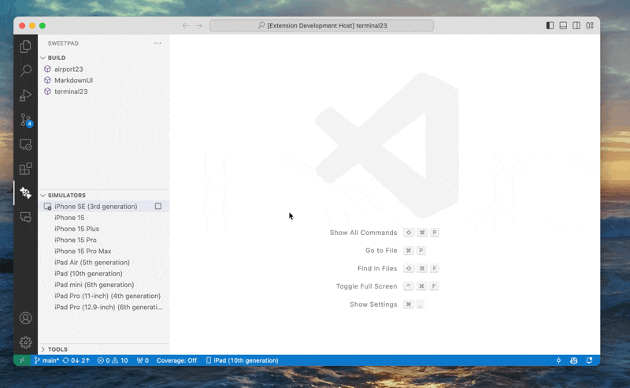

# SweetPad (alpha) 


Develop Swift/iOS projects using VSCode.

The long-term goal is to make VSCode as a viable alternative to Xcode for iOS development, by integrating open-source
tools such as **swift-format**, **swiftlint**, **xcodebuild**, **xcrun**, **sourcekit-lsp**, and so on into VSCode.

## Feature

- 💅🏼 Format Swift files using **swift-format**.
- 📱 Run and stop the iOS simulator/emulator.
- 🍺 Install essential iOS tools using **homebrew**.
- 🧱 Build project using **xcodebuild** (simulator only)
- 🧠 Integrate Xcode with **sourcekit-lsp** for autocomplete functionality.
- 👩‍🌾 **WIP**: Lint Swift files using **swiftlint**.
- 🧪 **WIP**: Run tests with **swift test**.
- 💡 If you have any ideas, please open an issue or start a discussion on the
  [SweetPad](https://github.com/sweetpad-dev/sweetpad) GitHub repository.

## Requirements

1. 🍏 MacOS — Other platforms are currently not supported.
2. 🍺 Homebrew — Used for installing iOS development tools. More information can be found at https://brew.sh/

## Swift-format

This extension integrates [**swift-format**](https://github.com/apple/swift-format) with VSCode for formatting Swift
files. You can also enable "Format on Save" to format Swift files automatically when saving.

[](./docs/images/format-demo.gif)

### Installation

To use this feature, first install **swift-format** using Homebrew:

```bash
brew install swift-format
```

Next, add the following configuration to your settings.json file:

```json
{
  "[swift]": {
    "editor.defaultFormatter": "sweetpad.sweetpad",
    "editor.formatOnSave": true
  }
}
```

Then, open your Swift file and press `⌘ + S` to format it 💅🏼

> 🙈 In case of errors, open the Command Palette with `⌘ + P` and run `> SweetPad: Show format logs`. This command will
> open an "Output" panel displaying logs from swift-format. If you encounter issues, grab the logs and open an issue on
> the SweetPad GitHub repository.

## Build & Run app on Simulator

You can build and run your iOS app directly on the simulator from the VSCode sidebar. This functionality leverages
`xcodebuild`, a component of the Xcode command-line tools.

[](./docs/images/build-demo.gif)

To build and run your app on the simulator, first open the folder containing your Xcode project. Then, open the SweetPad
tools panel on the left side of VSCode, navigate to the **"Build"** section, and click the **"Build & Run"** button next
to the schema name ▶️. The extension will prompt you to select a simulator, and then it will build and run your app on
the chosen simulator.

For optimal results, I highly recommend installing `xcbeautify` as well:

```bash
brew install xcbeautify
```

Alternatively, you can use the **"Tools"** section in the SweetPad panel to install `xcbeautify` and other essential
iOS.

### Main parts of the "Build" section:

[](./docs/images/build-preview.png)

1. Build & Run: Click the ▶️ button next to the schema name in the "Build" panel to build and run the app on the
   simulator.
2. Select Simulator: After clicking the "Build & Run" button, the extension will prompt you to select a simulator.
3. Build Logs: You can view the build logs in the "Terminal" panel, which will automatically open after you click the
   "Build & Run" button.

> ⚠️ This feature is currently in alpha and may not perform as expected. Should you encounter any issues, please report
> them by opening an issue on the SweetPad GitHub repository.

## Integrate Xcode with SourceKit-LSP

This extension helps you to integrate Xcode with SourceKit-LSP for autocomplete functionality. In order to start install
[Swift](https://marketplace.visualstudio.com/items?itemName=sswg.swift-lang) from the marketplace and and
[xcode-build-server] using Homebrew:

```bash
brew install xcode-build-server
```

Now create config file `buildServer.json` in the root of your project by running command: **"SweetPad: Create Build
Server Config"** from the command palette. Now you have to build project in order to create build logs. After that you
autocmplete should work.

## iOS Simulator/Emulator

You can run and stop the iOS simulator directly from the VSCode sidebar. This functionality utilizes `xcrun`, which is a
component of the Xcode command-line tools.

[](./docs/images/simulators-demo.gif)

### Features:

1. 🚀 Boot iOS Simulator — Click the green `▶️` button next to the simulator name in the "Simulators" panel to boot the
   iOS Simulator.
2. 🛑 Stop iOS Simulator — Click the red `⏹` button next to the simulator name in the "Simulators" panel to stop the iOS
   Simulator.
3. 📱 Run iOS Simulator — Click the `📱` button at the top of the "Simulators" panel to run the iOS Simulator.
4. 🔄 Refresh iOS Simulators — Click the `↻` button at the top of the "Simulators" panel to refresh the list of iOS
   Simulators.
5. 🧹 Clean Simulator Cache — Use this feature to remove the simulator cache in case of errors.

If you are looking for more features, please open a discussion or issue on the
[SweetPad](https://github.com/sweetpad-dev/sweetpad) GitHub repository.

> 😱 If you encounter the error
> `Failed to start launchd_sim: could not bind to session, launchd_sim may have crashed or stopped responding` when
> trying to boot the iOS Simulator, use the "Remove simulator cache" button to clean the cache and try again.

## Tools

The extension provides an easy way to install essential iOS development tools using Homebrew. It also offers quick
access to the tools' documentation.

[](./docs/images/tools-demo.gif)

## Links

- [Twitter](https://twitter.com/sweetpad_dev)
- [GitHub](https://github.com/sweetpad-dev/sweetpad)

## Changelog

All notable changes to the "sweetpad" extension you can find in the [CHANGELOG.md](./CHANGELOG.md).

## License

This extension is licensed under the [MIT License](./LICENSE.md).
